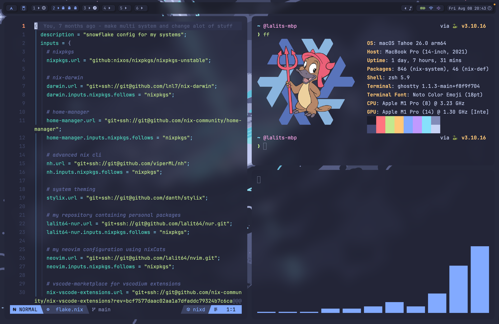
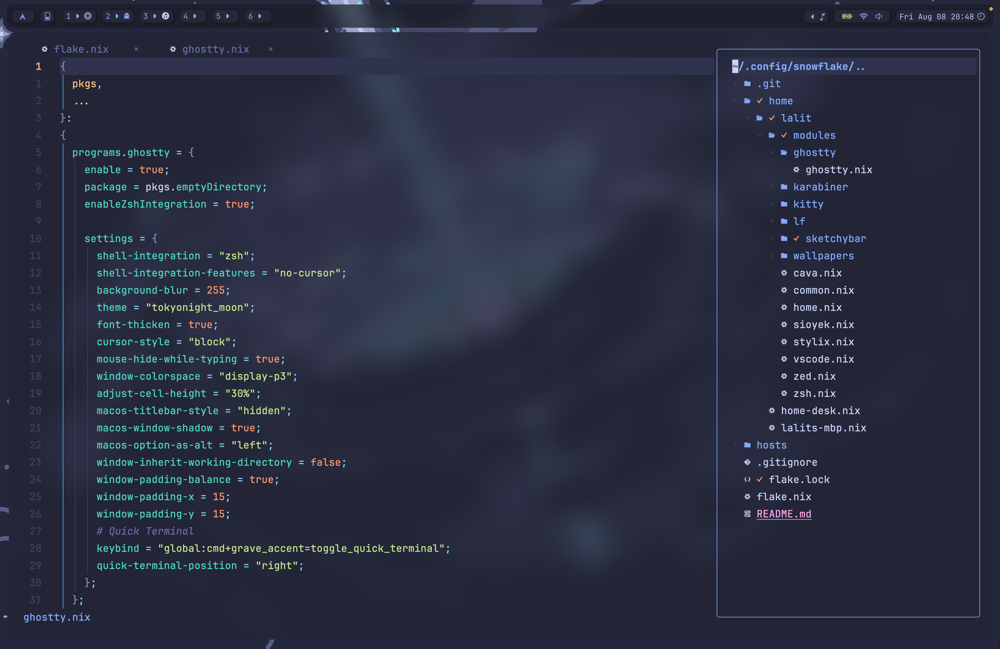
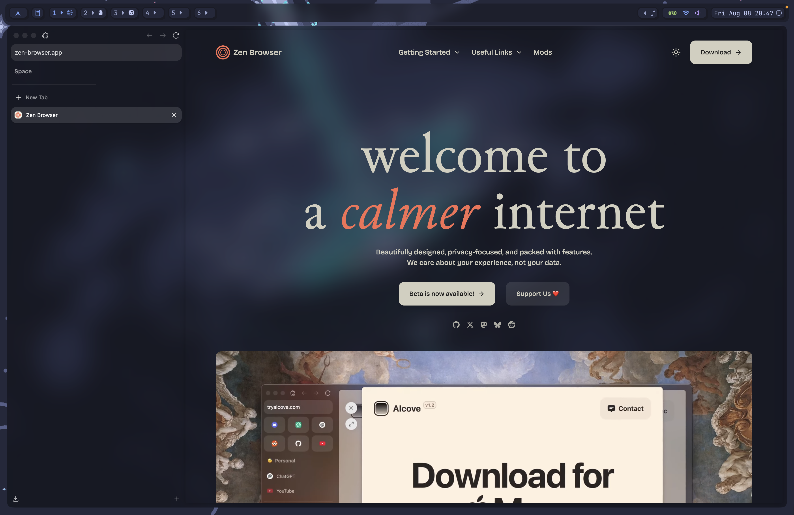

<div align="center">

    
</img>

    
</img>
</div>
<p align="center"><h1 align="center">snowflake</h1></p>
<p align="center">
	
	
	
</p>
<br>


    
</img>

    
</img>

    
</img>


## 🔗 Table of Contents

- [📍 Overview](#-overview)
- [👾 Features](#-features)
- [📁 Project Structure](#-project-structure)
- [🚀 Getting Started](#-getting-started)
  - [✅ Prerequisites](#-prerequisites)
  - [⚙️ Installation](#-installation)
  - [🤖 Usage](#-usage)
- [🙌 Acknowledgments](#-acknowledgments)

---

## 📍 Overview

This is my dotfiles repo containg a nix flake to install and configure everything on my system.

---

## 👾 Features

This is a multi machine home-manager and nix-darwin config containing everything including my applications, code editor, terminal, window manager, bar and much more.

---

## 📁 Project Structure

```sh
└── snowflake/
    ├── README.md
    ├── flake.lock
    ├── flake.nix
    ├── home
    │   └── lalit
    │       └── modules
    ├── hosts
    │   ├── home-desk
    │   ├── lalits-mbp
    │   └── modules
    └── result
```

## 🚀 Getting Started

### ✅ Prerequisites

Before getting started with building the system, make sure you have nix installed. Install nix using this command.

```sh
curl --proto '=https' --tlsv1.2 -sSf -L https://install.determinate.systems/nix | sh -s -- install
```

### ⚙️ Installation

Install my snowflake by doing:

1. Clone the snowflake repository:

```sh
❯ git clone https://github.com/lalit64/dotfiles ~/.config/snowflake
```

2. Navigate to the snowflake directory:

```sh
❯ cd ~/.config/snowflake
```

3. Build the flake using:

```sh
nix --extra-experimental-features "nix-command flakes" build .#darwinConfigurations.lalits-mbp.system
```

4. Lastly rebuild your system using:

```sh
./result/sw/bin/darwin-rebuild switch --flake ~/.config/snowflake/.#lalits-mbp
```

### 🤖 Usage

Whenever you need to rebuild your system use:

```sh
nixswitch
```
